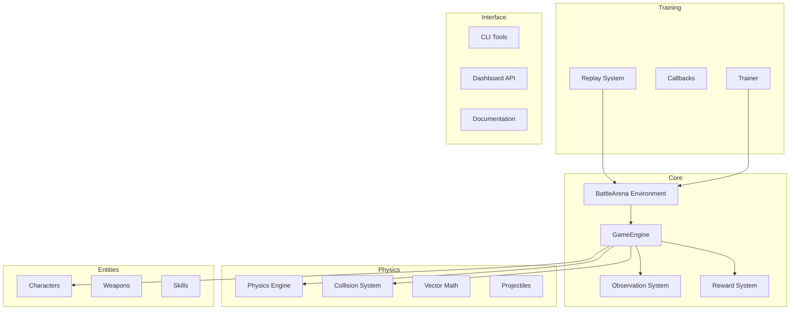
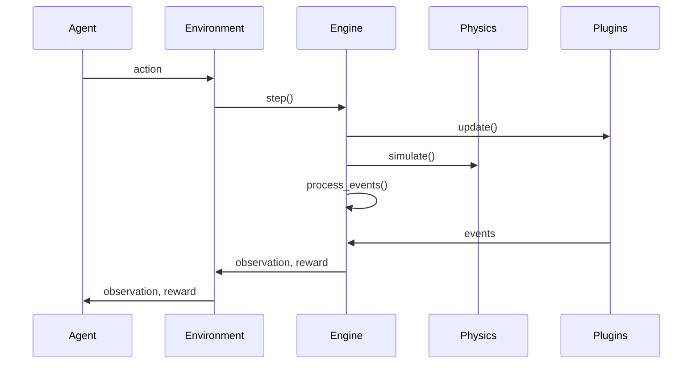

# ZBGym Architecture

## Overview

ZBGym is a professional Reinforcement Learning framework designed for battle arena simulations. It provides a Gymnasium-compatible environment with advanced physics, character systems, and training capabilities.

## Architecture Diagram



## Core Components

### 1. Environment (`zbgym.env`)

The main RL environment that follows the Gymnasium API.

- **BattleArena**: The primary environment for battle arena simulations
- Compatible with `gymnasium.make()` interface
- Supports vectorized environments for parallel training

### 2. Engine (`zbgym.engine`)

Core game engine components.

| Component | Description |
|-----------|-------------|
| EventBus | Event-driven communication system |
| TickSystem | Game loop management |
| GameEngine | Main engine orchestrator |
| MapManager | Map loading and management |
| SpawnSystem | Character spawn/respawn logic |

### 3. Physics (`zbgym.physics`)

Physics simulation components.

| Component | Description |
|-----------|-------------|
| Vector2D/3D | Vector mathematics |
| PhysicsBody | Base physics object |
| DynamicBody | Moving physics objects |
| Projectile | Bullet/projectile physics |
| MovementSystem | Character movement |

### 4. Plugins (`zbgym.plugins`)

Extensible entity system.

- **Characters**: Custom character types with stats and abilities
- **Weapons**: Weapon types with firing mechanics
- **Skills**: Active abilities with cooldowns

### 5. Observation (`zbgym.observation`)

State observation system.

- Plugin-based observation builders
- Automatic normalization
- Configurable observation pipelines

### 6. Reward (`zbgym.reward`)

Reward computation system.

- Modular reward components
- Weighted composition
- Configurable reward functions

### 7. Trainer (`zbgym.trainer`)

RL training infrastructure.

- PPO implementation via Stable-Baselines3
- Callbacks for checkpointing and evaluation
- TensorBoard logging support

### 8. Replay (`zbgym.replay`)

Episode recording and playback.

- Compressed replay format
- Replay buffer for analysis
- Episode recording during training

### 9. API (`zbgym.api`)

Dashboard backend.

- FastAPI REST endpoints
- WebSocket support for real-time updates
- Session and model management

### 10. CLI (`zbgym.cli`)

Command-line interface.

- `zbgym init`: Initialize project
- `zbgym train`: Train agent
- `zbgym evaluate`: Evaluate model
- `zbgym dashboard`: Start web dashboard

## Data Flow



## Plugin System

ZBGym uses a registry-based plugin system:

```python
@register_character("soldier", "Soldier", CharacterStats())
class SoldierCharacter(Character):
    pass

@register_weapon("rifle", "Assault Rifle", WeaponType.RIFLE, WeaponStats(...))
class Rifle(Weapon):
    pass
```

## Configuration

YAML-based configuration:

```yaml
env_id: BattleArena-v1
algorithm: PPO
total_timesteps: 1000000
learning_rate: 3e-4
num_envs: 4
```

## Dependencies

- **Core**: numpy, gymnasium
- **Training**: stable-baselines3, torch
- **Dashboard**: fastapi, uvicorn
- **Dev**: pytest, ruff, mypy
